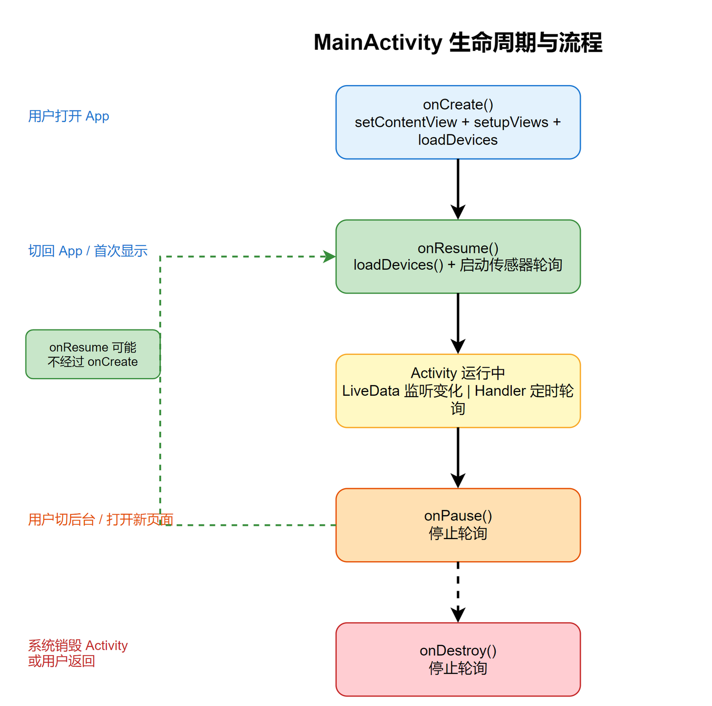

# Kotlin Android BLE Mesh App 学习计划

## 项目介绍

基于 Android 平台的低功耗蓝牙 Mesh 设备管理应用（com.example.ble_device_mesh），用 Kotlin + nRF Mesh 库实现智能灯光控制、传感器数据读取和定时任务管理。

## 建议学习顺序

| 序号 | 文件 | 知识点 | 难度 |
|------|------|--------|------|
| 1 | data/MeshDevice.kt | data class、val vs var、可空类型、enum、@Parcelize | 入门 |
| 2 | data/DeviceRepository.kt | Context、SharedPreferences、Gson、Lambda、companion object | 入门 |
| 3 | MainActivity.kt | Activity 生命周期、RecyclerView、LiveData Observer、Intent | 基础 |
| 4 | DeviceDetailActivity.kt | SeekBar、Collapsible 折叠面板、AlertDialog、Spinner | 基础 |
| 5 | ProvisionActivity.kt | 权限请求、AlertDialog、RecyclerView Adapter | 基础 |
| 6 | SettingsActivity.kt | 文件选择器、导入导出 | 基础 |
| 7 | MeshViewModel.kt (上) | ViewModel、LiveData、object 单例、setCallback 模式 | 进阶 |
| 8 | BleConnectionManager.kt | BLE GATT、MTU、descriptor、write 模式 | 进阶 |
| 9 | MeshViewModel.kt (中) — 配网流程 | nRF Mesh API、状态机、超时处理 | 进阶 |
| 10 | MeshViewModel.kt (下) — 控制逻辑 | 传感器、时间同步、调度器 | 进阶 |

---

## Kotlin 核心语法速查表

| 概念 | 写法 | 含义 |
|------|------|------|
| 只读变量 | `val x = 42` | 不能重新赋值 |
| 可变变量 | `var x = 42` | 可以重新赋值 |
| 可空类型 | `String?` | 可以为 null |
| 安全调用 | `s?.length` | null 时不崩 |
| Elvis 操作符 | `s ?: "默认"` | null 时用默认值 |
| Lambda 隐参 | `list.filter { it > 3 }` | `it` 是单参数的隐式名 |
| 数据类 | `data class User(val name: String)` | 自动生成 equals/hashCode/toString/copy |
| 委託属性 | `val vm by viewModels()` | 懒加载，Activity 重建时保留 |
| 伴生对象 | `companion object { ... }` | 静态成员，等于 Java `static` |
| 匿名对象 | `object : Interface { ... }` | 匿名内部类 |
| 类型判断 | `if (x !is String)` | instanceof |
| 格式化 | `"%02X".format(0xA)` | 等于 `String.format` |
| 密封类 | `sealed class Result { ... }` | 有限子类的抽象类 |
| 具名参数 | `func(param = value)` | 按参数名传值 |
| 默认参数 | `fun f(a: Int = 0)` | 不传时用默认值 |

---

## 第1课：MeshDevice.kt — 数据模型

文件路径：`data/MeshDevice.kt`，共 27 行。

### 完整代码逐行解析

```kotlin
package com.example.ble_device_mesh.data
```
**包声明** —— 等于 Java 的 `package`。文件中在 `data/` 目录下，所以包名里带 `.data`。所有在同一 `package` 下的类可以直接互相调用，不需要 import。

```kotlin
import android.os.Parcelable
import kotlinx.parcelize.Parcelize
```
**导入依赖** —— `Parcelable` 是 Android 序列化接口，让对象可以在 Activity 间传递。`@Parcelize` 是 Kotlin 注解，自动生成序列化代码（省掉手写几百行模板）。

```kotlin
@Parcelize
data class MeshDevice(
    val id: String,                             // 唯一标识，如 "mesh_5"
    var name: String,                           // 设备名称，如 "客厅灯光"
    val address: Int,                           // Mesh Unicast 地址，如 0x0005
    val type: DeviceType,                       // 设备类型：LIGHT/SWITCH/SENSOR/OTHER
    var groupAddress: Int? = null,              // Group 地址，如 0xC000，可为 null
    var brightness: Int = 50,                   // 亮度 0-100，默认 50
    var temperature: Float? = null,             // 温度(°C)，传感器设备才有
    var deviceTime: Long? = null,               // 设备时间(Unix 秒)
    var lightLevel: Float? = null,              // 光照度(lux)
    var isOnline: Boolean = false,              // 是否在线
    val addedTime: Long = System.currentTimeMillis()  // 添加时间戳
) : Parcelable
```

### data class 自动生成什么

`data class` 只需声明字段，编译器自动生成：
- `equals()` — 比较两个对象
- `hashCode()` — 哈希值
- `toString()` — 打印输出，如 `MeshDevice(id=mesh_5, name=灯光, address=5, type=LIGHT)`
- `copy()` — 复制对象

### val vs var 设计思路

| 关键字 | 用在 | 原因 |
|--------|------|------|
| `val` | id, address, type, addedTime | 设备 ID 和地址不会变 |
| `var` | name, brightness, temperature | 用户会改名称，亮度/温度实时变化 |

### 空安全：? 的含义

```kotlin
var temperature: Float? = null   // Float? = 可为 null 的浮点数
```
- 不加 `?` — 永远不会是 null（编译器强制）
- 加 `?` — 值可以是 null（传感器设备没有温度传感器时就是 null）

### @Parcelize 的作用

加上 `@Parcelize` + 继承 `Parcelable`，对象就可以用 `Intent.putExtra()` 在 Activity 间传递：

```kotlin
// 发送方 (MainActivity)
intent.putExtra(DeviceDetailActivity.EXTRA_DEVICE, device)

// 接收方 (DeviceDetailActivity)
device = intent.getParcelableExtra(EXTRA_DEVICE, MeshDevice::class.java)
```

### enum class 枚举类

```kotlin
enum class DeviceType {
    LIGHT,   // 灯光
    SWITCH,  // 开关
    SENSOR,  // 传感器
    OTHER    // 其他
}
```
限制设备类型只能是 4 种之一，防止赋值一个不存在的类型。用法：`device.type == DeviceType.LIGHT`。

---

## 第2课：DeviceRepository.kt — 本地数据存取

文件：`data/DeviceRepository.kt`，89 行。作用：把设备列表存到手机本地，下次打开 App 还在。

### Context 是什么

```kotlin
class DeviceRepository(context: Context) {
```
`Context` 是 Android 的核心对象，所有系统服务（文件、SharedPreferences、蓝牙、显示 Toast）都通过它访问。每次创建 Repository 传入当前 Activity 即可：
```kotlin
deviceRepository = DeviceRepository(this)   // this = 当前 Activity
```

### SharedPreferences — 轻量键值存储

```kotlin
private val prefs: SharedPreferences =
    context.getSharedPreferences("mesh_devices", Context.MODE_PRIVATE)
```

| 参数 | 值 | 含义 |
|------|-----|------|
| `"mesh_devices"` | 文件名 | 数据存在 `/data/data/包名/shared_prefs/mesh_devices.xml` |
| `MODE_PRIVATE` | 私有模式 | 只有本 App 能访问 |

### Gson — JSON 序列化

```kotlin
private val gson = Gson()
```
把对象转 JSON 字符串存盘：
```json
[{"id":"mesh_5","name":"客厅灯","address":5,"type":"LIGHT","brightness":50}]
```

### companion object — 静态成员

```kotlin
companion object {
    private const val KEY_DEVICES = "devices"
}
```
`companion object` = Java 的 `static`。`const val` 是编译时常量，值永远不会变。`KEY_DEVICES` 是 SharedPreferences 里的 key 名。

> 和 `object` 的区别：`companion object` 是类内部静态成员，`object` 是独立单例。

### Elvis 操作符 ?:

```kotlin
val json = prefs.getString(KEY_DEVICES, null) ?: return emptyList()
```
左侧为 null 时走右侧——等于 `if(json == null) return emptyList()`。

### Gson 反序列化 + TypeToken

```kotlin
val type = object : TypeToken<List<MeshDevice>>() {}.type
return gson.fromJson(json, type)
```
`TypeToken` 是为了告诉 Gson 泛型的具体类型（Java/Kotlin 泛型在运行时会被擦除，所以需要这个技巧）。

### apply() vs commit()

```kotlin
prefs.edit().putString(KEY_DEVICES, json).apply()
```
- `edit()` → 打开编辑器
- `putString(key, value)` → 写入数据
- `apply()` → **异步提交**到磁盘（不等写完，立即返回）

| 方法 | 行为 | 返回值 |
|------|------|--------|
| `apply()` | 异步写磁盘 | 无 |
| `commit()` | 同步写磁盘 | boolean（成功/失败） |

### Lambda 和 it 隐参

```kotlin
devices.any { it.id == device.id }          // 有任何一个 id 匹配？
devices.indexOfFirst { it.id == device.id } // 第一个匹配的索引
devices.find { it.id == deviceId }           // 找第一个匹配
devices.removeAll { it.id == deviceId }      // 删除所有匹配的
```
`it` 是 Lambda 单参数的隐式名，等于写 `device -> device.id`。

### 方法设计模式

```kotlin
// 读：public
fun getAllDevices(): List<MeshDevice> { ... }

// 写：private，外部只能通过 add/update/delete
private fun saveDevices(devices: List<MeshDevice>) { ... }
```
**封装思想**：外部不需要知道底层用 SharedPreferences 存 JSON，直接用 `addDevice()` / `deleteDevice()` 就好。

### 实际调用链

```
MainActivity.loadDevices()
  → deviceRepository.getAllDevices()
    → SharedPreferences.getString("devices")
    → Gson.fromJson(json) → List<MeshDevice>
  → deviceAdapter.updateDevices(list)
    → RecyclerView 刷新显示

ProvisionActivity 配网成功后
  → MeshViewModel.saveDeviceToLocal()
    → deviceRepository.addDevice(device)
      → getAllDevices().toMutableList()
      → devices.add(device)
      → saveDevices(devices)
        → Gson.toJson(devices)
        → SharedPreferences.edit().putString().apply()
```

---

## 第3课：MainActivity.kt — 主界面与 Activity 生命周期

文件：`MainActivity.kt`（302 行）+ `activity_main.xml`（245 行）+ `MeshDeviceAdapter.kt`（226 行）

本课覆盖三个文件，核心是理解 Android 的 **Activity 生命周期**、**LiveData 观察者模式**、**RecyclerView 列表**和 **Handler 定时轮询**。

### 整体架构图



### 3.1 Activity 生命周期

```kotlin
class MainActivity : ComponentActivity() {
    override fun onCreate(savedInstanceState: Bundle?)  // 创建时调用一次
    override fun onResume()                              // 可见时调用（onCreate 之后，或从后台切回）
    override fun onPause()                               // 失去焦点时调用（切后台 / 打开新页面）
    override fun onDestroy()                             // 销毁时调用
}
```

**生命周期流程图：**

| 顺序 | 回调 | 何时触发 | 在 MainActivity 里做什么 |
|------|------|----------|--------------------------|
| 1 | `onCreate()` | App 首次打开 | `setContentView` 加载布局 → `setupViews()` 绑定按钮/列表 → `loadDevices()` 显示设备 |
| 2 | `onResume()` | 页面可见 | 刷新设备列表 + 启动 30 秒传感器轮询 |
| 3 | `onPause()` | 切换到后台/打开新页面 | 停止传感器轮询（省电） |
| 4 | `onDestroy()` | Activity 被系统回收 | 停止轮询（防止内存泄漏） |

**关键理解：onCreate vs onResume**
- `onCreate` — 只执行一次，做**初始化**（加载布局、创建 Adapter、绑定按钮）
- `onResume` — 每次页面可见都执行，做**刷新**（你从 DeviceDetailActivity 返回时，设备亮度可能变了，需要 `loadDevices()` 刷新）

### 3.2 委托属性 `by viewModels()`

```kotlin
private val viewModel: MeshViewModel by viewModels()
```

复习第 1 课的 `val` 和 `var`，这里 `by` 是**委托**（delegate），`by viewModels()` 的含义：

- **懒加载**：第一次访问 `viewModel` 时才创建
- **生命周期绑定**：Activity 旋转屏幕重建时，ViewModel 不会被销毁，自动保留数据
- **自动清理**：Activity 真正销毁时自动释放

没有 `by viewModels()` 的写法（不推荐）：
```kotlin
// 手动管理 —— 麻烦且容易出错
private lateinit var viewModel: MeshViewModel
override fun onCreate(...) {
    viewModel = ViewModelProvider(this).get(MeshViewModel::class.java)
}
```

### 3.3 lateinit — 延迟初始化

```kotlin
private lateinit var deviceAdapter: MeshDeviceAdapter
```

`lateinit var` 表示"我现在不赋值，但保证在使用之前一定会赋好值"。

- 为什么不用 `var deviceAdapter: MeshDeviceAdapter? = null`？因为如果用可空类型，每次用都要加 `?.` 或 `!!`，很繁琐
- `lateinit` 的承诺由开发者自己保证，如果在赋值前访问会抛 `UninitializedPropertyAccessException`

赋值的时机在 `setupViews()` 里：
```kotlin
deviceAdapter = MeshDeviceAdapter(mutableListOf(), ...)
```

### 3.4 findViewById — 从 XML 拿控件

```kotlin
val tvStatus = findViewById<TextView>(R.id.tvStatus)
val btnAddDevice = findViewById<Button>(R.id.btnAddDevice)
```

`findViewById<T>(R.id.xxx)` = 在 XML 布局里找对应 ID 的控件。`<>` 是泛型，告诉 Kotlin 返回什么类型。

对照 XML：
```xml
<TextView
    android:id="@+id/tvStatus"
    android:text="状态: 正在初始化 Mesh..." />
```
`R.id.tvStatus` 是 Android 编译时自动生成的 ID 常量，等于 `2131234567` 这样一个 int。

### 3.5 setOnClickListener — Lambda 点击事件

```kotlin
btnAddDevice.setOnClickListener {
    startActivity(Intent(this, ProvisionActivity::class.java))
}
```

`setOnClickListener { ... }` 设置点击监听器。这里传入的是一个 **Lambda**（匿名函数），当用户点击按钮时执行。

Java 对比：
```java
// Java 8 之前要写匿名内部类
btnAddDevice.setOnClickListener(new View.OnClickListener() {
    @Override
    public void onClick(View v) {
        startActivity(new Intent(MainActivity.this, ProvisionActivity.class));
    }
});
```

Kotlin 的 Lambda 让代码从 5 行变成 1 行。

### 3.6 Intent — 页面跳转

```kotlin
// 简单跳转（不带数据）
startActivity(Intent(this, ProvisionActivity::class.java))

// 带数据跳转
val intent = Intent(this, DeviceDetailActivity::class.java)
intent.putExtra(DeviceDetailActivity.EXTRA_DEVICE, device)
startActivity(intent)
```

`Intent` = 意图，相当于"我想打开某个页面"的请求。
- 第一个参数 `this` = 当前 Activity（Context）
- 第二个参数 `类名::class.java` = 目标 Activity 的 Java class
- `putExtra(key, value)` = 附带数据，接收方用 `getParcelableExtra(key)` 取出

### 3.7 LiveData Observer 模式

```kotlin
viewModel.statusText.observe(this) { status ->
    tvStatus.text = "状态: $status"
}
```

**LiveData** 是一种"可观察的数据容器"，**ViewModel** 持有 LiveData，**Activity/View** 观察变化。

```
ViewModel.statusText (LiveData<String>)
  └─ .observe(lifecycleOwner) { 新值 ->
       更新 UI
     }
```

流程：
1. ViewModel 里某处改了 `statusText.value = "已连接到 Proxy"`
2. LiveData 自动通知所有 Observer
3. Observer 里的 Lambda 执行，`tvStatus.text = "状态: 已连接到 Proxy"`

**第一个参数 `this`** = `LifecycleOwner`（Activity 自己），LiveData 会根据 Activity 的生命周期自动开始/停止观察：
- `onResume` 后 → 开始接收更新
- `onPause` 后 → 暂停接收（避免不可见时更新 UI 造成崩溃）

### 3.8 解构声明 `(address, temperature)`

```kotlin
viewModel.temperatureUpdates.observe(this) { (address, temperature) ->
    // address 和 temperature 从 Pair 中自动拆出来
}
```

这就是 **解构声明（Destructuring）**。`temperatureUpdates` 的类型是 `LiveData<Pair<Int, Float>>`，通过 `(address, temperature)` 把 Pair 的两个值拆到两个变量里。

```kotlin
// 等价写法（不解构）
viewModel.temperatureUpdates.observe(this) { pair ->
    val address = pair.first
    val temperature = pair.second
}
```

### 3.9 RecyclerView — 列表控件三件套

RecyclerView 是 Android 的列表控件，需要三个组件配合：

| 组件 | 在哪个文件 | 作用 |
|------|-----------|------|
| **RecyclerView** | `activity_main.xml` | UI 容器（负责显示和滚动） |
| **Adapter** | `MeshDeviceAdapter.kt` | 数据绑定（把数据变成 View） |
| **LayoutManager** | 代码里设置 | 布局方式（线性/网格/瀑布流） |

```kotlin
// MainActivity 中的配置
rvDevices.layoutManager = GridLayoutManager(this, 2)  // 2 列网格
rvDevices.adapter = deviceAdapter                       // 绑定适配器
```

### 3.10 Adapter 模式 — onCreateViewHolder vs onBindViewHolder

```kotlin
class MeshDeviceAdapter(...) : RecyclerView.Adapter<MeshDeviceAdapter.ViewHolder>() {

    // 1. 创建 ViewHolder（只在需要新卡片时调用）
    override fun onCreateViewHolder(parent: ViewGroup, viewType: Int): ViewHolder {
        val view = LayoutInflater.from(parent.context)
            .inflate(R.layout.item_mesh_device, parent, false)
        return ViewHolder(view)
    }

    // 2. 绑定数据到 ViewHolder（每个卡片显示时都调用）
    override fun onBindViewHolder(holder: ViewHolder, position: Int) {
        val device = devices[position]
        holder.tvDeviceName.text = device.name
        holder.tvDeviceAddress.text = "地址: 0x${device.address.toString(16)}"
    }

    // 3. 返回数据数量
    override fun getItemCount() = devices.size
}
```

**为什么分成 onCreate 和 onBind？** — 性能。`onCreateViewHolder` 只在需要**新**卡片时执行（比如屏幕只能显示 6 个卡片，就只创建 6 个 ViewHolder），滚动时复用已有的 ViewHolder，只调用 `onBindViewHolder` 换数据。

```
屏幕显示 6 个卡片 ← 只创建 6 个 ViewHolder
向下滚动 → 顶部卡片消失，底部新卡片出现
旧 ViewHolder 被复用，onBindViewHolder 换成新数据
```

### 3.11 ItemTouchHelper — 拖拽排序与删除

MeshDeviceAdapter 中实现了**长按拖拽排序**和**拖到垃圾桶删除**：

```kotlin
fun attachToRecyclerView(rv: RecyclerView) {
    val callback = object : ItemTouchHelper.SimpleCallback(
        ItemTouchHelper.UP or ItemTouchHelper.DOWN or
        ItemTouchHelper.LEFT or ItemTouchHelper.RIGHT, 0
    ) {
        override fun onMove(rv: RecyclerView, vh: ViewHolder, target: ViewHolder): Boolean {
            Collections.swap(devices, from, to)     // 交换数据位置
            notifyItemMoved(from, to)                // 通知 UI 刷新动画
            return true
        }

        override fun clearView(rv: RecyclerView, vh: ViewHolder) {
            // 松手时判断：卡片中心在垃圾桶区域内 → 删除
            if (hitTrash) onDeleteClick(device)
            else onOrderChanged(devices.toList())
        }
    }
}
```

**垃圾桶碰撞检测**通过屏幕绝对坐标判断：
```kotlin
val trashRect = Rect()
trash.getGlobalVisibleRect(trashRect)   // 垃圾桶在屏幕上的矩形区域
hitTrash = trashRect.contains(screenX, screenY)  // 卡片中心在里面？
```

### 3.12 编辑模式 — 抖动动画

长按设备卡片进入编辑模式，卡片开始抖动（类似 iOS 删除 App 的效果）：

```kotlin
private fun startWobble(holder: ViewHolder) {
    val rotate = ObjectAnimator.ofFloat(holder.itemView, "rotation", -2f, 2f).apply {
        duration = 180
        repeatCount = ObjectAnimator.INFINITE  // 无限循环
        repeatMode = ObjectAnimator.REVERSE    // 来回摇摆
    }
    holder.wobbleAnimator = AnimatorSet().apply { play(rotate); start() }
}
```

`ObjectAnimator` 自动在 -2° 到 +2° 之间来回旋转（`REVERSE`），持续 180ms 一周期。

### 3.13 Handler + Runnable — 定时轮询

```kotlin
private val handler = Handler(Looper.getMainLooper())
private val temperatureRunnable = object : Runnable {
    override fun run() {
        if (isFinishing || isDestroyed) return  // 安全检查

        if (viewModel.isConnected.value == true) {
            devices.forEach { device ->
                viewModel.readSensors(device.address)
            }
        }
        handler.postDelayed(this, 30000)  // 30 秒后再次执行
    }
}
```

`Handler` 是 Android 的消息队列机制，`postDelayed(runnable, 30000)` = 把这段代码安排到主线程，30 秒后执行。关键是 `this`（Runnable 自己），执行完之后又把自己放进队列——形成**循环**。

```
onResume() → postDelayed(runnable, 5000)  // 5 秒后首次
            → 5 秒后 run() 执行
              → readSensors()
              → postDelayed(this, 30000)  // 30 秒后再来
                → 30 秒后 run() 执行
                  → readSensors()
                  → postDelayed(this, 30000)  // 无限循环...
```

**必须 removeCallbacks**：`onPause` 和 `onDestroy` 中调用 `handler.removeCallbacks(temperatureRunnable)` 停止循环，否则 Activity 销毁后 Runnable 还持有引用 → 内存泄漏。

### 3.14 XML 布局结构

MainActivity 使用 `FrameLayout` 作为根布局，实现了**悬浮垃圾桶**效果：

```
FrameLayout (根布局，子 View 叠加)
├── LinearLayout (主内容，垂直排列)
│   ├── 顶部栏：标题 + 设置按钮 + "配网设备"按钮
│   ├── 状态栏：tvStatus + tvSrcAddress
│   ├── RecyclerView：设备网格（weight=1，占满剩余空间）
│   ├── 空状态提示：默认 gone，无设备时 visible
│   └── 底部导航栏：主页 | 设置 | 我的
├── 垃圾桶区域：悬浮在顶部，默认 gone，编辑模式 visible
```

`layout_weight="1"` — 在 LinearLayout 中，weight=1 表示"占满剩余空间"。RecyclerView 通过 `layout_height="0dp" + layout_weight="1"` 占满中间所有空余高度。

### 3.15 when 表达式

```kotlin
val deviceType = when (spinnerDeviceType.selectedItemPosition) {
    0 -> DeviceType.LIGHT
    1 -> DeviceType.SWITCH
    2 -> DeviceType.SENSOR
    else -> DeviceType.OTHER
}
```

`when` 是 Kotlin 的 switch 增强版，不需要 `break`，每个分支自动断开。

### 3.16 return@setOnClickListener — 标签返回

```kotlin
btnConfirm.setOnClickListener {
    if (name.isEmpty()) {
        Toast.makeText(this, "请输入设备名称", Toast.LENGTH_SHORT).show()
        return@setOnClickListener  // 从 Lambda 返回，不继续往下执行
    }
    // ... 继续创建设备
}
```

`return@setOnClickListener` = 从当前 Lambda 返回，而不是从外层函数返回。普通 `return` 在 Lambda 里不允许。

### 3.17 文件选择器（SettingsActivity 补充）

```kotlin
// 注册文件选择器 — 选择 JSON 文件
private val filePickerLauncher = registerForActivityResult(
    ActivityResultContracts.GetContent()
) { uri: Uri? ->
    uri?.let { importMeshConfig(it) }
}

// 启动选择器
btnImportConfig.setOnClickListener {
    filePickerLauncher.launch("application/json")
}

// 读取文件内容
private fun importMeshConfig(uri: Uri) {
    val inputStream = contentResolver.openInputStream(uri)
    val reader = BufferedReader(InputStreamReader(inputStream))
    val jsonData = reader.readText()   // Kotlin 扩展函数，读到 String
    reader.close()
}
```

`registerForActivityResult` — Android 新版 API，替代旧的 `startActivityForResult`：
- 注册时传入契约（`GetContent` = 选取文件）
- Lambda 是回调（用户选完文件后执行）
- `launch("application/json")` 打开文件选择器，只显示 JSON 文件

### 调用链汇总

```
App 启动
  → onCreate()
    → setContentView(R.layout.activity_main)     // 加载 XML
    → setupViews()
      → findViewById 拿控件
      → 创建 MeshDeviceAdapter(点击回调, 删除回调, 排序回调)
      → 设置 GridLayoutManager(2 列)
      → rvDevices.adapter = deviceAdapter
      → 绑定按钮点击事件
      → LiveData.observe 监听状态变化
    → loadDevices()
      → deviceRepository.getAllDevices()          // 从 SharedPreferences 读
      → deviceAdapter.updateDevices(list)         // 刷新 RecyclerView
  → onResume()
    → loadDevices()              // 再次刷新（从其他页面返回时）
    → startTemperaturePolling()  // 启动 30 秒轮询

用户点击设备卡片
  → onDeviceClick(device)
    → openDeviceDetail(device)
      → Intent(this, DeviceDetailActivity::class.java)
      → intent.putExtra(EXTRA_DEVICE, device)
      → startActivity(intent)
    → onPause()  ← MainActivity 切换到后台
      → handler.removeCallbacks()  // 停止轮询

用户从 DeviceDetailActivity 返回
  → onResume()  ← 重新可见
    → loadDevices()               // 刷新（亮度可能变了）
    → startTemperaturePolling()   // 恢复轮询

ViewModel 数据变化
  → statusText.value = "已就绪"
    → LiveData 通知所有 Observer
      → tvStatus.text = "状态: 已就绪"
```

### 本节新知识点清单

| 概念 | 代码 | 说明 |
|------|------|------|
| 委托属性 | `by viewModels()` | 懒加载 + 生命周期绑定 |
| 延迟初始化 | `lateinit var` | 非空但延后赋值 |
| 泛型 findViewById | `findViewById<Button>(R.id.xxx)` | 指定返回类型 |
| Lambda 点击 | `setOnClickListener { ... }` | 匿名函数简化写法 |
| Intent 跳转 | `Intent(this, Target::class.java)` | 页面导航 |
| Parcelable 传参 | `intent.putExtra(key, device)` | 第 1 课的 @Parcelize 在此用上 |
| LiveData.observe | `liveData.observe(this) { ... }` | 响应式数据绑定 |
| 解构声明 | `{ (a, b) -> ... }` | 从 Pair 拆包 |
| RecyclerView 三件套 | View + Adapter + LayoutManager | 高性能列表 |
| ViewHolder 复用 | `onCreateViewHolder` / `onBindViewHolder` | 滚动性能核心 |
| GridLayoutManager | `GridLayoutManager(this, 2)` | 2 列网格 |
| ItemTouchHelper | 拖拽排序 / 拖到垃圾桶删除 | 手势交互 |
| 垃圾桶碰撞检测 | `getGlobalVisibleRect()` + `contains()` | 屏幕坐标判断 |
| ObjectAnimator | 抖动动画 (`rotation`, `INFINITE`, `REVERSE`) | 属性动画 |
| Handler 定时器 | `postDelayed(this, 30000)` 自循环 | 轮询传感器 |
| 内存泄漏防范 | `removeCallbacks()` | onPause 必须停 |
| FrameLayout 叠加 | 悬浮垃圾桶 | 层级布局 |
| layout_weight | `weight="1"` 占满剩余空间 | 弹性布局 |
| when 表达式 | `when(x) { 0 -> ... else -> ... }` | 强化版 switch |
| Lambda 标签返回 | `return@setOnClickListener` | 从 Lambda 退出 |
| 文件选择器 | `registerForActivityResult(GetContent())` | 导入 JSON 配置 |
| use 扩展函数 | `outputStream?.use { ... }` | 自动 close 的 try-with-resources |